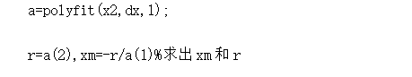

## logistics(阻滞增长模型)

​	该模型主要用来预测人口，但是希望到时数模比赛的时候也能用上用来预测别的

### 模型相关

1. **对于该模型的介绍以及实际运用**

   1.1 模型介绍可以参考[logistic人口发展模型](https://wenku.baidu.com/view/b37b1406a6c30c2259019e6b.html)，里面对应的有推导过程和运用。最重要的就是这两个公式。

   

       
   

   ​	我们只是使用公式(5)，其中xm代表这个模型对应的最大值，r代表x的增长率，这两个值可以通过这篇文章中的这样计算

   

       
   

   

   ​	也可以通过[lsqcurvefit](https://www.mathworks.com/help/optim/ug/lsqcurvefit.html#d122e108031)基于最小二乘法拟合得出，具体方式参考[校赛中的使用](https://github.com/lympassion/Mathematical-model-Los-Angeles/blob/main/results/%E4%BA%BA%E5%8F%A3%E5%8F%98%E5%8C%96/)。

2. **相关参考文献**

   下个月使用数字图书馆再加入。

